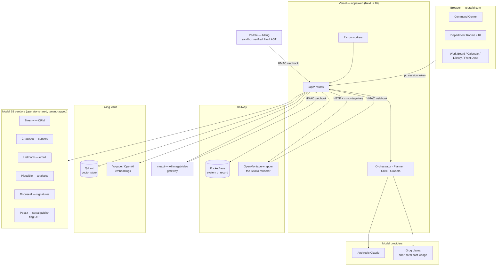

# STAFFD — The Living Architecture Document

> **Status:** Living document. Update this when anything structural changes — a new vendor, a new loop, a new surface, a pricing change. Last full revision: **2026-08-04**.
> **Audience:** The operator (SA) and any engineer or AI session picking up this codebase cold. Read this first, then `STAFFD-SAD.md` for deeper subsystem detail.

---

## 1. What STAFFD is

**STAFFD is an AI staffing company in a box.** A small-business owner signs up at **urstaffd.com**, describes their business once, and gets a full staff of AI specialists — marketing, sales, legal, HR, finance, operations, design, paid media, reputation, and a CEO — who produce real deliverables: documents, campaigns, contracts, images, and complete produced videos. The owner doesn't "prompt an AI"; they **brief their staff** the way they'd brief employees, and the staff remembers, plans, schedules, produces, and asks for approval before anything leaves the building.

The one-line pitch that runs through the product copy: *"Staff your business — without staffing your business."*

### The three ideas everything else hangs off

1. **Model B3 — invisible operator-shared vendors.** STAFFD customers never see a vendor name or manage an API key. The operator (you) runs one shared instance of each backend tool (CRM, email, support desk, analytics, signatures, video renderer), and every customer gets an invisible, **tenant-tagged slice** of it. To the customer it's just "my staff sent the campaign." Clients enforce tenancy at the code level: every vendor client is constructed `forCustomer(userId)` and refuses untenanted access.

2. **Loop engineering, not vibes.** Borrowed from the Auto-Company framework and the harness/loop/graph engineering specs: every autonomous action runs inside a **Doer → Grader → Retry** loop with evidence-based stopping ("stop on evidence, never confidence"), circuit breakers, and confessing fallbacks (when a fallback fires, it *says so* in the thread — it never impersonates the real thing). Anything outbound or destructive is gated behind human review (HITL).

3. **The participation moment.** The machine does 95% of the work, then deliberately hands the owner a steering wheel for the last 5% — editing a scene's on-screen text, choosing the outro, approving a draft. That last touch converts "the machine made this" into "I made this."

---

## 2. System map



**Everything flows through `/api/*` on Vercel.** The browser only ever talks to STAFFD; STAFFD talks to vendors. Webhooks (Montage, muapi, Paddle, Docuseal, Listmonk, Twenty) flow back in, each verified with its own HMAC secret.

---

## 3. Repos, deploys, and where things physically live

| Thing | Where | Notes |
|---|---|---|
| **Main repo** | `C:\Users\xrupe\Vault\staffd` → `github.com/xrupert/staffd` (public) | pnpm + Turborepo monorepo. Push to `main` = deploy. |
| **Web app** | `apps/web` — Next.js 16 App Router | Deployed on **Vercel**, project `staffd-web` (`prj_ED9NcZSM4IEUIPSDV061qIPSWRwX`, team `team_DikRP2hidtLl3cOs3dxcDV8x`), domain **urstaffd.com** |
| **Agent workforce** | `packages/agents` | Shared TS package `@staffd/agents` — every agent definition, routing, brand laws |
| **PocketBase** | Railway | System of record. URL in `NEXT_PUBLIC_POCKETBASE_URL`; admin creds `PB_ADMIN_EMAIL` / `PB_ADMIN_PASSWORD` |
| **OpenMontage fork (the Studio)** | `C:\Users\xrupe\OpenMontage` → `github.com/xrupert/OpenMontage` (public, **AGPL**) | Railway project "OpenMontage" (`89219288-2ddc-490d-a25a-dafd581a9834`, service `084e2128-032a-4c0c-a5fa-bbcdc2078365`), domain `openmontage-production-52d2.up.railway.app`. Deploys from fork `main`. |
| **Architecture docs** | `docs/architecture/` | `STAFFD-SAD.md` (deep current-state), `STANDARDS.md` (engineering rules), `PARADIGM.md`, `STAFFD-CONNECTIONS.md`, this file |
| **Root docs** | `HANDOFF.md` (session onboarding), `CLAUDE.md` (AI-session rules + knowledge graph) | HANDOFF's repo path is stale (`~/staffd`); the repo lives in `Vault\staffd` |

### The TDD gate (non-negotiable, from STANDARDS.md)

Before any commit/push: `tsc --noEmit` clean → `vitest run` all green (190+ test files, ~1,280 tests) → `next build` succeeds. Tests **pin** behavior — live incidents become permanent fixtures (e.g., the exact TikTok script that once broke the parser is a test fixture forever).

---

## 4. The workforce — `packages/agents`

**138 registered specialists** across **10 departments** and **8 industry packs**, all defined in one TypeScript package that both the frontend (roster display) and backend (system prompts) import — a single source of truth.

- **Departments** (`src/departments/`): marketing, sales, legal, hr, finance, operations, design, paid-media, reputation, **ceo**. Each department has a canonical default agent (`DEPARTMENT_DEFAULT_AGENT_IDS`) plus a bench of named specialists (e.g., the TikTok Strategist, the Email Marketer) selected by task-tag matching.
- **Industry packs** (`src/packs/`): law, restaurants, real-estate, trades, salons, coaches, consultants, agencies. Packs auto-activate from the business vault's industry (D-19 "bridging") — a restaurant owner's scheduled marketing post comes from the restaurant-pack specialist, not the generic one.
- **Brand laws** (`brand-laws.ts`): applied to every agent at registry build — voice, "never name vendors," anti-hallucination rules.
- **Production rules** (`production-rules.ts`): the **producible-first rule** — video-tagged agents and the design department write scripts STAFFD can actually produce (text-on-screen, screen-record). Camera-facing/talking-head formats are **opt-in only**, because those scripts belong to the owner's face, and no pipeline is allowed to invent an AI presenter for them (that was a live incident — see §7).
- **CEO mental models** (`mental-models.ts`): the CEO department reasons with named frameworks (inversion, second-order effects, etc.) and has a verify node on its surfaces.

### How a task finds its specialist (`/api/agent` resolution order)

1. Caller-pinned `agentId` (an explicit pick always wins)
2. `routeTask(task, department, {activePacks})` — tag-match the task text to the best specialist
3. The department's pack-aware default

---

## 5. The request lifecycle — what happens when an owner asks for something

`POST /api/agent` (`apps/web/app/api/agent/route.ts`) is the heart. In order:

1. **Identity** — the PocketBase session token is resolved server-side (`resolveAgentUserId`); the body's userId is never trusted.
2. **Rate limit + trial gate** — PB-backed daily limit; trial exhaustion returns 402.
3. **CEO short-circuit** — `department === "ceo"` delegates to the orchestrator's `synthesize` intent (cross-department workload + vault + continuity).
4. **Context assembly** (parallel):
   - **Business Vault** (`businesses` collection) → rendered vault block (name, industry, audience, **staff_directives** — standing orders the staff always obeys)
   - **Voice profile** (`vault_voice_profile`) — the owner's writing fingerprint, recomputed nightly
   - **FC-1d Live Business Data** — real-time reads from connected tools, department-gated (sales sees the CRM, marketing sees campaign stats + site traffic, operations/reputation see the support inbox). Fail-open, 3s time-boxed. `_lib/integrations/context-reads.ts`
   - **LIVING MEMORY** — semantic retrieval from the Living Vault (Qdrant): top-K relevant past work injected as context. Falls back to last-2-same-dept docs if retrieval is empty.
5. **Conversation memory** — the client sends `history[]` (last 8 turns); replies to a specialist's clarifying question **bypass the router** and go straight back to the same specialist (`lastCompleted.agentId`). This killed the single-turn amnesia defect (fix `96f5170`).
6. **Model routing** (`_lib/llm-router.ts`) — short-form tasks (captions, replies) route to **Groq Llama** as a cost wedge (skipped when history is present); legal/finance/operations and long-form always go **Anthropic**. Groq failure falls through to Anthropic Haiku — a cost optimization is never a single point of failure.
7. **Stream** the response; **persist both turns** to `conversations` (threaded via `conversation_threads`) and enqueue them for Vault ingestion.

After generation, the **action classifier** (W62/W63) proposes post-generation chips from a locked 10-action vocabulary (`_lib/orchestrator/action-vocabulary.ts`) — generate the visual, schedule a follow-up, add to CRM, send for signature… Each chip dispatches through `useActionDispatcher` to the **same code path as the static buttons** (no duplicated backends), and every outbound write goes through **confirm-to-commit** (`/api/intent/commit` + `ConfirmActionModal`) with an undo window (`UndoToast` + `autopilot_audit_log`).

---

## 6. The intelligence layer — loops, harness, graph

This is the "where is the loop engineering?" answer, made concrete:

| Loop | Where | What it does |
|---|---|---|
| **Planner → Critic → Materialize** | `_lib/orchestrator/plan-goal.ts`, `_lib/loop/critic.ts`, `_lib/workflow-materialize.ts` | An L4 goal ("launch my summer campaign") becomes a typed multi-step plan, criticized before commit, materialized as `workflows` + `workflow_tasks` rows. Always propose-then-ratify — a chip click never auto-executes. |
| **Task bus + drain** | `/api/worker/workflow-drain` (per-minute cron), `_lib/workflow/` | Pulls ready tasks (DAG dependency gate), runs them 4-concurrent through `/api/agent` or system handlers (`WORKER_HANDLERS`), persists outcomes. |
| **Output grader** | `_lib/loop/grader.ts` | Evidence gate on every drained task output; rejects garbage, feeds rejection reasons into the retry prompt (corrective retry, not a coin re-flip). |
| **Circuit breaker** | inside the drain | Persisted per-workflow failure count; too many terminal failures trips the breaker instead of burning tokens forever. |
| **Render grader** | `/api/webhooks/montage` `gradeRender()` | ffprobe-measured video duration vs. the scripted timeline; a render under 50% of scripted length is **failed, never delivered** (this is what killed the "8-second nonsense clip" class of failure). Absent evidence passes — the grader acts only on affirmative mismatch. |
| **Wake-gates** | `_lib/worker/wake-gate.ts` | Cron overlap guard: each scheduled row is **claimed** (`planned → working`) before expensive work, so overlapping cron fires can't double-produce; stale `working` rows (crashed runner) are reclaimed after 2h. |
| **Review gate (HITL)** | `StaffWorkQueue` + `/api/workflows/[id]/approve|cancel` | Anything outbound (support replies, signature sends) pauses at `awaiting_review` with an editable draft. |
| **Follow-on suggestions** | drain `onComplete` | Completed goal workflows get up to 3 "what's next" chips — the think-ahead half of the loop. |

**Confessing fallbacks** are doctrine everywhere: if the Studio can't take a render, the thread says so and clearly labels the single-clip fallback a *teaser*; camera-facing scripts **never** fall back to AI clip generation.

**Graph/knowledge tooling for engineering itself:** the repo carries a `code-review-graph` MCP + pre-commit hook + `.claude/skills` (explore-codebase, debug-issue, refactor-safely, review-changes) so AI sessions navigate by structure, not grep. (Known quirk: the pre-commit hook crashes on cp1252 — set `PYTHONIOENCODING=utf-8`.)

---

## 7. The Studio — complete video production (OpenMontage)

**What it is:** STAFFD's exclusive video production engine — a fork of `calesthio/OpenMontage` (AGPLv3) wrapped in a thin FastAPI service on Railway. It turns a strategist's *script* into a **complete, timed, branded video** rendered with Remotion — not an 8-second AI clip.

### The AGPL boundary (never cross this)

- The fork + wrapper stay **public** (`xrupert/OpenMontage`). STAFFD talks to it **over HTTP only**.
- **NEVER import OpenMontage composer components (or their Remotion compositions) into STAFFD's frontend** — that creates covered-work contamination. All previews (e.g., the Finishing Touches scene strip) are independent STAFFD-built React/CSS. A test pins this (`finishing-touches.test.ts` → "AGPL boundary pin").
- STAFFD's proprietary spec generation lives in the private-side of the boundary (`apps/web/app/api/_lib/montage/`).
- Remotion licensing: free ≤3 employees, then the paid tier (~$0.01/render) — flagged for S5 cost accounting.

### The pipeline

```
script (strategist output)
  → parseBeats()           spec.ts — two-pass parser, tolerant of the real formats
                           strategists emit (🪝 HOOK (0:00–0:03), RETENTION HOOK #1,
                           PATTERN INTERRUPT, Beat N, CTA; m:ss and Ns timings;
                           Spoken-copy-wins; On-screen text separated)
  → buildEditDecisions()   typed Remotion scenes (hero_title / text_card / callout)
                           honoring script timings + a 3s branded logo_outro
                           (business name from the vault — the owner's mark)
  → produceStudioVideo()   produce-core.ts — shared by the interactive route AND
                           the campaign runner: create project → startRenderProps
                           → generation_jobs ledger row (credit_weight 0 until S5)
  → wrapper /render_props  operation="remotion_render", schema-free composition_data
  → completion webhook     HMAC x-montage-signature + measured duration_seconds
  → gradeRender()          <50% of scripted duration = failed, never delivered
  → delivery               output proxied through /api/montage/output/[jobId]
                           with a signed capability token (?t= HMAC) because
                           <video> elements can't send auth headers (fix a59b889)
  → Library                completeJob writes a Library document for every
                           finished visual (P4a)
```

### Wrapper API (Railway service, `wrapper/main.py` in the fork)

| Endpoint | Purpose |
|---|---|
| `GET /health` | liveness (no auth) |
| `POST /projects` | create project |
| `POST /projects/{id}/assets` | download caller-supplied asset URLs into the manifest |
| `POST /projects/{id}/render` | schema-validated `edit_decisions` render (AI-clip timeline path) |
| `POST /projects/{id}/render_props` | **the production path** — props-driven typed-scene render |
| `GET /jobs/{id}`, `GET /jobs/{id}/output` | status + mp4 |

Auth: every route requires `x-montage-key` == `MONTAGE_API_KEY` (fail-closed 503/401). Completion webhooks POST to `STAFFD_WEBHOOK_URL` signed with `MONTAGE_WEBHOOK_SECRET`. Job outcomes are printed to Railway logs (`[render_props] job=… SUCCEEDED in 26.3s duration=29.0s`).

### Finishing Touches (S4b — the participation moment)

After a cut is delivered in the Command Center, **"✨ Add finishing touches"** opens a STAFFD-built director's pass: a proportional scene-strip timeline, editable on-screen copy per scene, and the outro control. One click re-renders through the same produce path (`/api/montage/touches`, `FinishingTouchesModal.tsx`). Re-renders are keyed off the finished job's ledger id and poll like any generation.

### The campaign runner (P3)

A strategy document with ≥2 scripted videos gets a **"Schedule this campaign"** chip → `/api/campaign/schedule` books each producible video on a Mon/Wed/Fri cadence as `scheduled_content` `kind="video_production"` rows (camera-facing scripts are skipped and reported, not silently dropped). The daily worker produces each one on its date; delivery, grading, and the bell notification are all downstream and unchanged.

---

## 8. The generation plane — images and single clips (muapi)

- **muapi** is STAFFD's platform-scoped AI image/video gateway (deliberately NOT a Model B3 integration — it's billed in credits, operator env only: `MUAPI_API_KEY`).
- `POST /api/integrations/muapi` submits; jobs live on the **`generation_jobs` ledger** (fingerprint dedup, claim-first idempotent charging, tier weights) and complete via HMAC webhook or poll (`/api/generation/[id]/status`).
- **Tiers** (quick/pro/cinema) picked in `GenerationTierInline`/`Modal`; **Cinema packs** are the one purchasable top-up (+10/$39, +30/$99).
- Images return ~3 options unmetered; **edit-as-intent** (`/api/generation/edit`) classifies a plain-English instruction ("make it warmer") into an edit op against an existing artifact.
- **Demographic-bias guard:** the enricher prompt (`_lib/generation/enricher-prompt.ts`) forbids inventing on-camera presenters — the Chinese video models (Kling/Hunyuan/Seedance) default to Asian-presenting subjects, which produced the two bias incidents; presenters now only appear when the user explicitly asks.
- The catalog of available vendor models syncs hourly (`/api/worker/muapi-catalog-sync` → `generation_models`).

---

## 9. Vendor directory — every external service, where it lives, how it's reached

All Model B3 vendors resolve credentials through **one seam**: `_lib/integrations/resolve.ts` → user's own encrypted creds (in `user_integrations`, AES via `INTEGRATION_ENCRYPTION_KEY`) win; the **operator env fallback is super-admin only** (no cross-tenant leak). Tenant-tagged clients live in `_lib/integrations/<vendor>/client.ts`.

| Vendor | Role | Tenancy | Env vars | Code | Customer-facing surface |
|---|---|---|---|---|---|
| **Twenty** | CRM | tenant field on every Person | `TWENTY_API_URL/KEY/WEBHOOK_SECRET` | `integrations/twenty/` | Sales: "Add to CRM" (create_contact intent), FC-1a reads, FC-1d live context |
| **Chatwoot** | Support inbox | per-customer inbox `staffd-<userId>` | `CHATWOOT_URL/API_KEY/ACCOUNT_ID` | `integrations/chatwoot/` | Front Desk, reply_to_ticket (review-gated), FC-1b reads, FC-1d |
| **Listmonk** | Email campaigns | per-customer list `staffd-<userId>` | `LISTMONK_URL/USERNAME/PASSWORD/WEBHOOK_SECRET` | `integrations/listmonk/` | Marketing: "Send as campaign" (draft_campaign intent), FC-1c stats, FC-1d |
| **Plausible** | Web analytics | per-customer `plausible_site_id` on `businesses` | `PLAUSIBLE_API_URL/KEY`, `NEXT_PUBLIC_PLAUSIBLE_URL/SITE_ID` | `integrations/plausible/` | Business Pulse widget, FC-1d traffic context |
| **Docuseal** | E-signatures | submission-scoped | `DOCUSEAL_URL/API_KEY/TEMPLATE_ID/WEBHOOK_SECRET` | `integrations/docuseal/` | Legal/Sales: "Send for signature" (review-gated intent) |
| **Postiz** | Social publishing | — | `POSTIZ_URL/API_KEY` | `integrations/postiz/` | **Behind `PUBLISH_ENABLED=false`** — wired but OFF until flipped |
| **OpenMontage service** | Complete video renders | project-per-render, operator key | `MONTAGE_URL/API_KEY/WEBHOOK_SECRET` | `integrations/montage/client.ts` + `_lib/montage/` | The Studio (§7) |
| **muapi** | AI image/video models | platform-scoped (credits) | `MUAPI_API_KEY/WEBHOOK_SECRET` | `integrations/muapi/` | All image + single-clip generation |
| **Paddle** | Billing (MoR) | per-customer subscriptions | `PADDLE_API_KEY`, `PADDLE_PRICES`, `PADDLE_NOTIFICATION_WEBHOOK_SECRET`, `NEXT_PUBLIC_PADDLE_ENV` | `_lib/billing/` (BillingProvider seam), `/api/billing/*`, `/api/webhooks/paddle` | Checkout overlay, portal, Cinema packs |
| **Anthropic Claude** | Primary brain | — | `ANTHROPIC_API_KEY` | 9 allowlisted SDK sites (W61′) | every specialist |
| **Groq Llama** | Short-form cost wedge | — | `GROQ_API_KEY` | `_lib/llm-router.ts` | invisible |
| **Qdrant** | Vector store (Living Vault) | collection per user/client | `QDRANT_URL/API_KEY` | `_lib/qdrant.ts`, `_lib/vault/` | LIVING MEMORY, Smart Search |
| **Voyage / OpenAI** | Embeddings (Voyage preferred) | — | `VOYAGE_API_KEY`, `OPENAI_API_KEY` | `_lib/vault/ingest.ts` | invisible |
| **PocketBase** | System of record + auth | row rules per user | `NEXT_PUBLIC_POCKETBASE_URL`, `PB_ADMIN_EMAIL/PASSWORD` | `lib/pb.ts` (client), `_lib/pb.ts` (server admin) | everything |
| **Web Push** | PWA notifications | per-subscription | `VAPID_*`, `NEXT_PUBLIC_VAPID_PUBLIC_KEY` | `/api/push/*`, brief dispatcher | morning brief pushes, bell |

**Integration health** is surfaced in `IntegrationsHealthPanel` / `ConnectedAccounts` (settings), tested via `_lib/integrations/test-connection.ts`.

### The FC layers (how vendor access is structured)

- **FC-1 (reads):** `GET /api/integrations/twenty|chatwoot|listmonk` + **FC-1d** context injection — the staff *sees* live business state.
- **FC-2 (writes):** every write is an **intent** (`create_contact`, `draft_campaign`, `send_for_signature`, `reply_to_ticket`) through `/api/intent/commit` with per-customer confirm modals, review gates for anything outbound, and undo via the audit log. Action chips (FC-2c) and static buttons share the exact same functions.

---

## 10. Billing — Paddle (deliberately LAST)

- **State:** PR-Paddle-A shipped and **sandbox-verified end-to-end** (simulation → 200, signature + `billing_events` dedup + PB write live-tested). Catalog seeded; price IDs in `PADDLE_PRICES` env.
- **Architecture:** everything behind the `BillingProvider` seam — checkout intents (overlay or redirect), webhook processing with idempotent `billing_events`, `subscriptions` rows in PB, customer portal, Cinema pack top-ups (`cinema-10` $39 / `cinema-30` $99).
- **Ratified sequence:** Paddle **live** is the FINAL step of the whole program — after S5 cost instrumentation produces a real unit-economics sheet and SA re-ratifies pricing against measured margins (studio render costs, model costs, muapi costs). Going live = swap six Vercel values to live creds + live webhook destination + live catalog seed (needs `PADDLE_LIVE_API_KEY`, verified account, approved domain). **Paddle live = relaunch.**

Plans and gating live in `lib/plans.ts` + the trial system (`_lib/trial.ts` — per-department trial runs, plan-based department/pack entitlements).

---

## 11. The crons (vercel.json)

| Path | Schedule | Job |
|---|---|---|
| `/api/worker/scheduled` | daily 08:00 UTC | Content calendar: due `scheduled_content` → generate content / start workflow goals / **produce campaign videos**. Wake-gated (claim + stale reclaim). Also runs daily rollups: retrieval p95, voice profile recompute. |
| `/api/worker/workflow-drain` | every minute | The task bus drain (§6): DAG-gated, graded, breaker-protected. |
| `/api/worker/vault` | every minute | Living Vault ingestion queue → summarize → embed → Qdrant. |
| `/api/worker/morning-brief` | daily 06:00 UTC | CEO morning brief generation. |
| `/api/worker/brief-push-dispatcher` | every 15 min | Timezone-aware push delivery of briefs. |
| `/api/worker/security-audit` | daily 02:00 UTC | Security sweep. |
| `/api/worker/muapi-catalog-sync` | hourly | Vendor model catalog mirror. |

All cron routes accept `Bearer CRON_SECRET` (Vercel) or `x-worker-secret: WORKER_SECRET` (manual).

---

## 12. Data model — PocketBase collections

**Identity & business:** `users`, `businesses` (the Vault: name/industry/audience/description, `staff_directives`, `booking_slug`, `chatwoot_inbox_id`, `plausible_site_id`), `clients` (agency mode, UI hidden), `contacts`, `bookings`.

**Work:** `documents` (+ `document_versions`), `conversations` + `conversation_threads`, `scheduled_content` (kinds: `content` | `workflow_goal` | `video_production`; statuses: planned/working/review/completed/failed), `workflows` + `workflow_tasks` (the task bus), `generation_jobs` (the media ledger), `generation_models`, `templates`, `upload_sessions`.

**Memory & intelligence:** `vault_ingest_queue`, `vault_embeddings_index`, `vault_voice_profile`, `vault_patterns`, `vault_decisions`, `vault_briefs`, `vault_retrieval_metrics`, `orchestrator_decisions`, `orphan_decisions`.

**Billing & audit:** `subscriptions`, `billing_events` (webhook dedup), `notifications`, `push_subscriptions`, `autopilot_audit_log` (the undo substrate), `super_admin_usage_log`, `super_admin_audit_log`, `user_integrations` (encrypted per-user vendor creds).

---

## 13. Frontend surfaces

| Surface | Route | What it is |
|---|---|---|
| **Command Center** | `/dashboard` (top) | The front door: routing theater (switchboard animation → specialist match), streaming replies, conversation threads with memory, produce chips on scripted videos, inline media with Finishing Touches, campaign scheduling, action chips, voice input |
| **Department Rooms** | `/dashboard/<dept>` ×10 | Per-department workspace: specialist roster (+ Industry Specialists tab), quick actions, output with a ≤4-action row + More menu, handoffs ("Send to…"), design room generation controls |
| **Staff Work Board** | `/dashboard/work` | Kanban of everything: Planned / In progress / Waiting on you / Done, fed from scheduled_content + workflows + generation_jobs |
| **Calendar** | `/dashboard/calendar` | Month view of produced + planned + bookings; recurring staff |
| **Library** | `/dashboard/library` | Every deliverable, searchable/filterable, share links, exports; Smart Search (`/dashboard/search`) does semantic retrieval |
| **Front Desk** | `/dashboard/front-desk` | The support inbox (Chatwoot slice) with review-gated replies |
| **CEO Briefing** | dashboard card | Morning brief memorandum ceremony |
| **Vault** | `/dashboard/vault` | The business profile the staff works from + staff directives editor |
| **Settings** | `/dashboard/settings` | Profile, billing portal, password, privacy (GDPR export/delete), section nav |
| **Onboarding** | `/onboarding` | Business intake → vault |
| **Public** | `/` (landing), `/pricing`, `/book/<slug>` (public booking), `/doc/<id>` (shared docs), `/auth/*` | |

Design system: dark theme (#09090F bg, #111118 cards, #5B21E8/#A07BFF purple), Laws-of-UX pass (PR-UX-1/2/3): motion system with reduced-motion support, focus-visible, AA contrast, skeletons, hero moments (routing theater, generation blur-reveal, video slate, CEO memorandum), Escape-close + backdrop-close modals everywhere.

---

## 14. Security model

- **Server-authoritative identity:** every API route resolves the caller from the PB token (`whoAmI` / `resolveAgentUserId`); body-supplied user IDs are never trusted.
- **Webhook verification:** every inbound webhook is HMAC-verified with its own secret, fail-closed (503 when unconfigured, 401 on bad signature); billing events dedup on event id.
- **Capability URLs:** media delivery uses per-artifact signed tokens (HMAC `?t=`) because media elements can't send auth headers — each token unlocks exactly one video.
- **Tenancy:** Model B3 clients refuse construction without a customer id; operator env fallback is super-admin-gated; per-user vendor creds are AES-encrypted at rest.
- **HITL:** outbound writes (support replies, signatures, campaigns) require explicit confirm and/or review-gate approval; undo windows on autopilot actions.
- **Secrets:** never in chat, never in the repo (public!), only in Vercel/Railway env + `.env.local`.
- **Super-admin:** `ADMIN_*` env + `_lib/auth/super-admin.ts`; premium ops by the operator are logged to `super_admin_usage_log`.

---

## 15. Engineering doctrine (the short version of STANDARDS.md)

1. **TDD gate before every push** (tsc, vitest, build) — push-to-main deploys production.
2. **Stop on evidence, never confidence** — graders act on measured facts (ffprobe duration, output shape), and absent evidence never blocks.
3. **Confessing fallbacks** — degraded paths announce themselves; nothing impersonates the real thing.
4. **Single source of truth** — agents in `packages/agents`; action vocabulary locked in one file; produce path shared by interactive + scheduled; plans in `lib/plans.ts`.
5. **Pin incidents as tests** — every live failure becomes a permanent fixture.
6. **No duplicated backend paths** — chips, buttons, and workers call the same functions.
7. **Vendor invisibility** — customer-facing copy never names a vendor.
8. **AGPL discipline** — HTTP-only to the Studio; no composer imports; the fork stays public.

---

## 16. Current status & what's left (as of 2026-08-04)

**Recently shipped (this program):** routing intelligence fixes · loop layer (grader/critic/breaker/recurring staff) · full Studio pipeline with first verified render + delivery fix · conversation memory fix · campaign runner · media→Library · wake-gates · FC-2c chips · FC-1d live context · Staff Work Board · S4b Finishing Touches · wrapper duration evidence + logging.

**In flight (uncommitted in working tree):** UX-3 remainder — dept-room 4+More action row, settings section nav, mobile header collapse, library delete-undo (partially edited), plus pending: onboarding cascade, `lib/plans.ts` dedup, emoji-chrome→SVG sweep, radius unification.

**Then, in order:**
1. **S5 — cost instrumentation** → per-job vendor cost on the ledger → unit-economics sheet → **SA re-ratifies pricing against real margins**
2. **Paddle LIVE** (the ratified last step): live keys, live catalog, six Vercel value swaps, live webhook → **relaunch**

**Deferred/waiting:** Postiz publish behind `PUBLISH_ENABLED` flag · PB SMTP (password-reset emails don't send) · routing degradation watch (`[route.degraded]` logs) · agency/clients UI (hidden pending W94 redesign).

---

## 17. Keeping this document alive

- When you add a vendor: add a row to §9 (env vars, code path, surface, tenancy).
- When you add a loop or gate: add a row to §6.
- When you add a cron: §11. A collection: §12. A surface: §13.
- When status changes (Paddle live, pricing ratified): rewrite §16 and bump the date at the top.
- Deep detail belongs in `STAFFD-SAD.md`; this document stays the **map**, not the territory.
