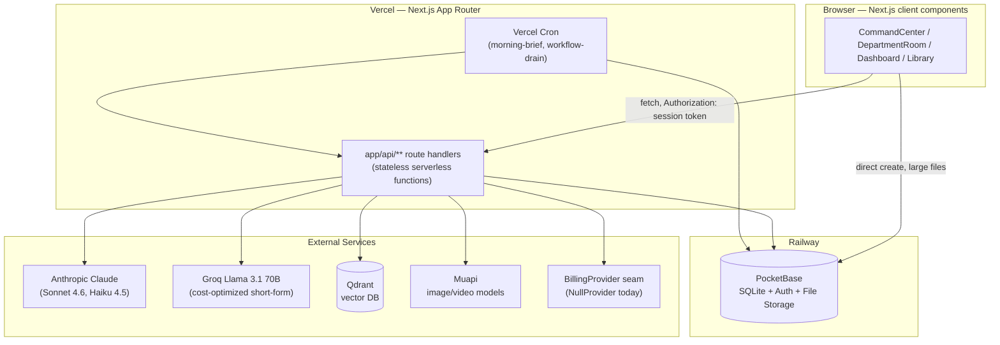
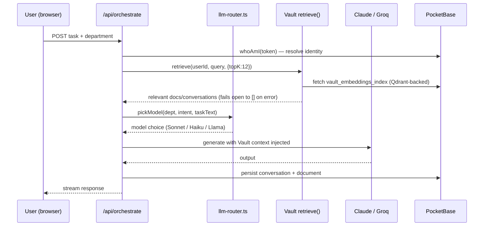
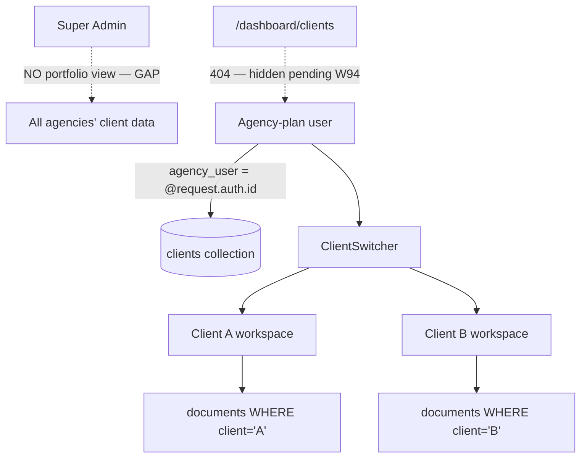

# STAFFD — Software Architecture Document

**Status:** Living document, verified against codebase 2026-07-01
**Audience:** Incoming senior engineer / architecture handoff
**Scope:** Current production system as it exists today. See the companion document `STAFFD-rebuild-lovable-recommendation.md` for the forward-looking rebuild analysis.

---

## 1. Executive Summary

STAFFD is a B2B SaaS product that gives a small business a **staff of AI department specialists** — Marketing, Sales, Legal, HR, Finance, Operations, Paid Media, Design, Reputation — plus a cross-department "CEO" advisor. A customer signs up, fills in a Business Vault (company profile), and then works the way they'd work with a real hire: they chat with a department, ask for a document or campaign, and the specialist produces it using the business's own context.

**Target users** are two distinct populations sharing one codebase:
1. **Direct customers** (Starter/Growth/Pro plans) — a single business running its own staff.
2. **Agencies** (Agency plan, $450/mo) — a company that runs STAFFD *on behalf of* multiple client businesses, switching between client workspaces from one login.

**Value proposition:** instead of hiring a marketing coordinator, a bookkeeper, and a paralegal, a small business (or the agency serving many small businesses) gets an AI staff that already knows the business, remembers its history, and gets measurably better over time via the Vault's retrieval layer.

**What makes it more than "an LLM wrapper":**
- A Business Vault that every specialist reads from and writes patterns back into (RAG-backed memory, not a stateless chatbot).
- An **autopilot** system that graduates from "confirm every action" to "just do it" per (user, intent-type), with a 7-day no-questions-asked reversal window.
- An **L4 planner** that decomposes a stated goal into a dependency-ordered multi-step plan across departments, which the user approves once and an async worker then executes.
- A **Morning Brief** — an unprompted daily digest of what the staff did/found overnight, pushed to the user.
- **Edit-as-intent**: generated visuals can be refined by direction ("remove the background") instead of being thrown away and regenerated from scratch.

---

## 2. Requirements

### 2.1 Functional

| Area | Requirement |
|---|---|
| Onboarding | Signup → Business Vault fill-in → plan selection → department access unlocked per plan |
| Conversational core | Chat with a department (CommandCenter) or a dedicated department page (DepartmentRoom); threads persist |
| Document generation | Text, image, and video generation with tiered quality (Quick/Pro/Premium), credit-metered |
| Vault memory | Every interaction can write a pattern/decision back to the Vault; semantic search retrieves relevant history into every generation call |
| Multi-step planning | User states a goal; L4 planner proposes an ordered department plan; user approves; execution substrate drains it asynchronously |
| Autopilot | High-confidence, repeated (user, intent) pairs graduate to autonomous execution with an audit trail and revocation window |
| Morning Brief | Daily, per-user, multi-section digest generated by a cron worker, delivered via push notification |
| Document library | Search, filter, export (PDF/Word), share-by-link |
| Multi-client (Agency) | One agency login switches between isolated client workspaces; each client's documents/bookings/content are scoped by a `client` field |
| Booking | Public booking page per business, availability computed server-side, no-login required for the visitor |
| Billing | Plan checkout, add-ons (department, CEO), credit top-ups, self-service portal, cancellation — via a swappable `BillingProvider` (Stripe removed 2026-06-25; currently unconfigured, returns a stable 503) |
| GDPR | Full data export and cascading account deletion across ~25 owned collections, fail-open on the billing-cancellation step |
| Notifications | In-app inbox + web push for async events (generation ready, workflow complete, brief ready) |

### 2.2 Non-Functional

| Category | Requirement / current reality |
|---|---|
| Multi-tenancy | Row-level isolation by `user` (and `agency_user`/`client` for agencies) enforced by PocketBase collection rules — not application-layer filtering alone |
| Security | Every authed route derives identity from a verified session token (`whoAmI`), **never** a body-supplied `userId` — this is a standing convention (Standard #39) enforced after several IDOR fixes this session |
| Scalability | Vercel serverless functions (stateless, auto-scaled) in front of a **single PocketBase instance** (SQLite-backed) on Railway — this is the real ceiling; see §11 |
| Performance | Vercel functions cap request bodies at ~4.5MB — large uploads (images, documents) write **directly from the browser to PocketBase**, bypassing the Vercel function entirely |
| Availability | No documented SLA; cron workers (morning brief, workflow drain) are idempotent and retry-safe by design |
| Compliance | GDPR export/delete implemented; privacy/terms copy is provider-agnostic since the Stripe removal |
| Testability | 171 test files, 1121 passing tests (Vitest) as of the last full run — a genuine strength, not aspirational |

---

## 3. System Architecture

### 3.1 High-Level Diagram



### 3.2 Layers

1. **Presentation** — Next.js App Router pages/components, client-rendered, talking to the API layer and (for large uploads) directly to PocketBase using a scoped session token.
2. **API / orchestration** — `apps/web/app/api/**`, ~170 route files. Every route re-derives the caller's identity server-side; no route trusts client-asserted identity.
3. **Model routing** — `_lib/llm-router.ts` + `_lib/generation/routing.ts` pick a provider/model per department, intent, and message shape (see §5.6).
4. **Data / identity** — PocketBase: the single system of record for auth, relational data, and file storage. Enforces tenant isolation via collection rules, not just app-layer `WHERE` clauses.
5. **Async workers** — Vercel Cron hitting worker routes (`/api/worker/*`) for the morning brief and the workflow-task drain; both are idempotent so a missed or doubled invocation is harmless.
6. **External intelligence** — Anthropic (primary reasoning), Groq (cheap short-form, falls back to Haiku on failure), Qdrant (vault embeddings), Muapi (image/video generation).

### 3.3 Data Flow — a single chat turn



---

## 4. Multi-Tenancy Design

This is the section that matters most for the Agency use case, and it's worth being precise about **what is actually built today versus what is aspirational** — the gap is real and is the primary target of the rebuild recommendation.

### 4.1 What exists and works today

- **`clients` collection** — one row per client business, owned by an `agency_user` foreign key. Fields: name, industry, description, target_audience, contact info, brand-voice-style fields (`focus`, `situation`, `superpower`, `magic_wand`), status (active/archived).
- **Row-rule enforcement (`AGENCY_OWNED_RULES`)** — PocketBase collection rules require `agency_user = @request.auth.id`. This is enforced **by the database**, not by application code remembering to filter — the strongest form of tenant isolation available in this stack.
- **`ClientSwitcher` component** — functional and live. Fetches `/api/clients` (403s for non-Agency plans), lets the agency user pick a client or "Agency view," and stores the active selection in `localStorage`. Every downstream fetch (documents, bookings, scheduled content) includes the active `client` filter.
- **Scoped collections** — `documents`, `bookings`, `scheduled_content` all carry an optional `client` field; when a client is active, all reads/writes are scoped to it.

### 4.2 What does NOT exist yet (confirmed gaps)

- **`/dashboard/clients` returns 404** — the dedicated client-management UI is explicitly disabled (`notFound()`), with a code comment pointing at a pending **"W94 Operator Access System"** redesign. The backend route (`/api/clients`) is live; nothing renders it as a management surface today.
- **No cross-agency portfolio view for super-admins.** There is no route or dashboard that lets an operator see aggregate data across *all* agencies' clients. The isolation model only answers "can Agency X see Client Y's data" (yes, if X owns Y) — it does not yet answer "can STAFFD's own operators see everything for support/analytics."
- **"Agency sees it all" is a pricing-copy promise, not a built feature.** The Agency plan's marketing copy ("Multi-client dashboard") describes the ClientSwitcher + scoped-collections foundation, but there is no aggregate rollup view (e.g., "which clients are underperforming," "total documents produced across my portfolio this month") — an agency admin currently has to check clients one at a time.

### 4.3 Tenant isolation diagram



### 4.4 RBAC

There is no general role enum. The only roles are:
- **Authenticated user** (default) — sees only rows they own (`user = auth.id`).
- **Agency user** — additionally owns `clients` rows and can scope by `client`.
- **Super-admin** (`ADMIN_EMAIL` env match) — bypasses row rules for admin routes (`/api/admin/*`), audited via `super_admin_audit_log` / `super_admin_usage_log`.

---

## 5. Key Components & Cool Features

### 5.1 Business Vault + Semantic Retrieval
Every business fills in a profile (name, industry, description, target audience, brand voice). Every generation call retrieves the top-K most relevant prior documents/conversations via Qdrant-backed embeddings (`vault_embeddings_index`, `_lib/vault/retrieve.ts`) and injects them as context — this is why output quality compounds over time instead of staying flat. Retrieval fails **open** (returns `[]` with a `degraded: true` flag) rather than blocking generation on a vector-DB hiccup.

### 5.2 Autopilot (graduated autonomy)
Rather than a binary "auto-approve everything" toggle, autopilot graduates per **(user, intent_type)** pair: STAFFD tracks a `confirm_streak` in `autopilot_prefs`, and once a user has confirmed the same kind of action enough times, it offers to automate just that intent. Every autonomous fire is logged to `autopilot_audit_log`, and revoking autopilot suppresses re-offering for 7 days. This is a genuinely good trust-building UX pattern — most "AI agent" products default to either full-manual or a scary full-auto switch.

### 5.3 L4 Planner + Execution Substrate
A user states a goal; `_lib/orchestrator/planner.ts` asks an LLM for a topologically-ordered plan across departments (max 12 steps), which is **returned for approval, not auto-executed** (`/api/workflow/plan`). Once approved, `/api/worker/workflow-drain` (a per-minute cron) pulls ready tasks (dependencies satisfied), executes them via `/api/agent`, and reconciles the parent workflow when done. This propose-then-ratify pattern is the right call for anything touching a business's public-facing output.

### 5.4 Morning Brief
A cron worker (06:00 UTC) generates a per-user, multi-section digest — CEO synthesis, draft posts, review replies, follow-ups, ops summary — scoped to the user's unlocked departments, and pushes it via web push. Idempotent (skips users who already have tomorrow's brief).

### 5.5 Edit-as-Intent
Generated visuals aren't disposable — a user can direct a change ("remove the background," "make it warmer") and the system classifies the edit intent and routes it to the right transformation (`EDIT_MODELS`: remove_background, instruct_edit, recombine, trim, add_captions) instead of regenerating from scratch or orphaning the original.

### 5.6 Model Routing (already a plug-and-play seam)
`_lib/llm-router.ts` picks a model in priority order: (1) department override (Legal/Finance/Operations always get Sonnet — accuracy-critical), (2) intent override (synthesis/briefs get Sonnet, routing/handoff get Haiku), (3) task heuristics (short tasks route to Groq Llama 70B when configured, with automatic fallback to Haiku on Groq failure). This multi-provider-with-fallback pattern is exactly the shape the rest of the backend should be generalized toward (see rebuild doc §2).

### 5.7 BillingProvider Seam
As of 2026-06-25, all direct Stripe SDK usage was removed. `_lib/billing/provider.ts` defines a 3-method `BillingProvider` interface (`createCheckoutSession`, `createPortalSession`, `cancelSubscription`); a `NullBillingProvider` throws a typed `BillingNotConfiguredError` until a real processor (Paddle/Nickel) is wired in. Every consuming route catches that error and returns a stable `503 billing_not_configured` rather than a raw failure. **This is the reference pattern** for how every other hard-coded external dependency in the system should eventually look.

### 5.8 GDPR Compliance
`/api/account/delete` cascades a hard delete across ~25 owned collections, refuses super-admin self-delete (would orphan the production system), requires type-to-confirm on the account email, and fails **open** on the billing-cancellation step so a billing hiccup never blocks a user's legal right to erasure.

---

## 6. UX/UI Principles

STAFFD's frontend is the polished, consistent surface over a lot of asynchronous, sometimes-fallible backend machinery. The UX choices that matter:

| Law of UX | Where it's applied |
|---|---|
| **Hick's Law** (more choices = slower decisions) | The department grid is a flat 2x4/4-wide grid of exactly 9 named departments, not a nested menu — one glance, one tap. The Agency ClientSwitcher is a single dropdown, not a multi-step selector. |
| **Jakob's Law** (users expect your app to work like other apps they know) | Dashboard layout (sidebar-less, card-based, header-nav) mirrors familiar SaaS conventions (Stripe/Linear-style dashboards) rather than inventing new interaction patterns. |
| **Doherty Threshold** (keep response under ~400ms or show progress) | Chat responses stream token-by-token; async generation shows explicit "Opening checkout…", "Loading…" states rather than silent waits; the credits widget and notification bell poll rather than requiring manual refresh. |
| **Peak-End Rule** (people judge an experience by its peak and its ending) | The Morning Brief is designed as a "peak" moment — an unprompted, already-done-for-you digest — rather than one more thing the user has to go ask for. |
| **Aesthetic-Usability Effect** | Consistent dark theme, consistent card/border treatment (`#111118` / `#2A2A38` tokens) across every dashboard surface — a visually consistent app is perceived as more trustworthy and usable even when functionally identical. |
| **Fail-safe defaults / error transparency** | This session's production incidents were largely caused by *masked* errors (generic "Something went wrong" hiding a real 4.5MB-limit or field-name bug). The current standard is: surface a real, correlatable error, never a dead end. |
| **Progressive disclosure** | Autopilot doesn't ask "auto-approve everything?" — it earns trust incrementally, per intent type, and only offers automation once behavior has demonstrated it's safe to extend. |
| **Consistency & feedback** | Every destructive action (account delete, autopilot revoke) uses a type-to-confirm or explicit two-step pattern; every async action gets a visible loading/success/error state — no silent failures. |

**Accessibility gap to flag honestly:** no systematic accessibility audit (ARIA labeling, keyboard navigation, contrast ratio verification) has been done — this is a real gap for a handoff, not a strength to claim.

---

## 7. Tech Stack & Plug-and-Play — Honest Assessment

| Layer | Current tech | Swappable today? |
|---|---|---|
| Frontend | Next.js App Router, React, client components | N/A (this is the layer being reconsidered — see rebuild doc) |
| Auth + DB | PocketBase (self-hosted, SQLite, Railway) | **No.** `pb.collection(...)` calls are made directly from ~170 route files and dozens of client components. There is no repository/adapter layer. Migrating off PocketBase today means touching nearly the entire codebase. |
| LLM providers | Anthropic Claude (primary), Groq Llama (cost tier, with fallback) | **Yes.** `llm-router.ts` already abstracts model selection with a working fallback chain — this is the pattern to replicate elsewhere. |
| Billing | BillingProvider seam (currently `NullBillingProvider`) | **Yes.** This is the newest and cleanest seam in the system — a real reference implementation. |
| Vector search | Qdrant (external service) | **Partially.** Retrieval logic is centralized in `_lib/vault/retrieve.ts`, but it is not behind a generic interface — swapping Qdrant for pgvector or another vector store would mean rewriting that module, not swapping a config value. |
| Image/video generation | Muapi (catalog-driven, hourly-refreshed model slugs) | **Yes, by design.** Model slugs are validated against a live catalog rather than hard-coded, so new models can appear without a redeploy. |

**Bottom line:** two of the six layers (LLM routing, billing) are genuinely plug-and-play today. The database/auth layer — the one most central to "swap the backend" ambitions — is the least abstracted. This is the single most important fact for planning any rebuild (see the companion document).

---

## 8. Security

- **Identity derivation, never trust:** every authed route resolves the caller via `whoAmI(req)` against a verified PocketBase session token. Body-supplied `userId`/`email` fields are informational only. This is a hardened convention after multiple real IDOR fixes this session (billing portal, checkout, agent routes).
- **Row-level enforcement at the database, not just the app:** PocketBase collection rules (e.g., `user = @request.auth.id`, `agency_user = @request.auth.id`) mean a bug in application code cannot leak another tenant's rows — the database refuses the query.
- **Encrypted vendor credentials:** `user_integrations` stores API keys encrypted at rest (`v1:iv:tag:ciphertext` format), one row per (user, integration_type).
- **Dual-auth for setup/migration routes:** either a shared `x-setup-secret` header or a verified super-admin session — fails **closed** (503) if no secret is configured at all, rather than silently allowing.
- **Audited admin bypass:** every super-admin action against another user's data is logged to `super_admin_audit_log` / `super_admin_usage_log`.

---

## 9. Scalability

- **The real ceiling is PocketBase-on-SQLite as a single instance.** It is excellent for the current scale and dramatically simpler to operate than a managed Postgres + separate auth + separate object storage stack, but it is a single writer with no built-in horizontal scaling story. This should be treated as a known, accepted trade-off, not a hidden risk — it buys massive operational simplicity today at the cost of a future migration if write volume ever becomes the bottleneck.
- **Vercel serverless functions** scale independently of the database and are stateless by construction, which is why the *compute* side scales cleanly even though the *data* side doesn't yet.
- **The 4.5MB Vercel body-size cap** was worked around correctly — for documents/images, the browser writes directly to PocketBase using a scoped session token, and a lightweight finalize endpoint handles post-storage processing. This is the right pattern and should be the template for any future large-payload feature.
- **Cron workers are idempotent by design** (morning brief skips already-briefed users; workflow drain only pulls tasks whose dependencies are satisfied) — safe under retries or overlapping invocations.

---

## 10. Monitoring

**What exists:** structured console logging with correlatable prefixes (`[stripe.webhook]`, `[account.delete]`, `workflow-drain: processed=... succeeded=...`), an admin audit trail for super-admin actions, and a migration log for schema changes.

**Gap to flag honestly:** there is no APM/tracing tool (Sentry, Datadog, etc.) wired in as of this document. Errors are visible in Vercel's function logs and console output, but there's no alerting, no error-rate dashboard, and no distributed tracing across the async worker → LLM call → PocketBase write chain. For a production SaaS handling billing and GDPR-regulated data, this is the single highest-priority monitoring gap to close.

---

## 11. Deployment

- **Frontend + API:** Vercel, deployed from GitHub via `git push` to `main` (fast-forward merges from feature branches, established convention this session).
- **Database/Auth:** PocketBase self-hosted on Railway.
- **Workflow:** branch-per-feature (`feat/...`, `fix/...`), TDD'd, reviewed, fast-forward merged, pushed. Verified with a *live* post-deploy check, not just deploy-succeeded status — this project has a documented history of deploys that "succeed" on Vercel's dashboard while 500-ing every request (`node:fs` in serverless routes, `outputFileTracingRoot` misconfiguration).
- **Self-hosting option:** since PocketBase already runs self-hosted, the entire stack (Next.js via `next start` or a container, PocketBase via its existing Railway/Docker setup) can be moved off Vercel without an architecture change — the coupling to Vercel is deployment convenience, not a hard dependency.

---

## 12. Risks & Trade-offs

| Risk | Impact | Mitigation status |
|---|---|---|
| PocketBase/SQLite is a single-writer bottleneck at scale | High, long-term | Accepted trade-off for now; revisit if write volume becomes the constraint |
| No cross-agency admin/portfolio view | Medium — blocks the core "company runs it for many clients" pitch from being fully real | This is the primary gap the rebuild recommendation addresses |
| No APM/error monitoring | High — billing- and GDPR-adjacent code is running with console-log-only visibility | Not yet started |
| Billing is currently non-functional | High but intentional | `NullBillingProvider` returns a clean 503; a real provider (Paddle/Nickel) needs to be implemented against the existing seam |
| Notification "type" field is an untyped string | Low-medium | Works today; will need a typed registry before the notification surface grows much further |
| DB/auth layer has no adapter/repository abstraction | Medium — makes a backend migration expensive | See rebuild recommendation for a path that avoids paying this cost up front |
| No systematic accessibility audit | Medium, compliance-adjacent | Not yet started |

---

## Appendix A — Reference Implementation (representative code modules)

The `BillingProvider` seam is the cleanest example in the codebase of the pattern every external dependency should eventually follow: a small interface, a null/stub implementation that fails loudly and typed (not silently), and a single factory function as the swap point.

```ts
// apps/web/app/api/_lib/billing/provider.ts
export class BillingNotConfiguredError extends Error {
  constructor() {
    super("No billing provider is configured yet.");
    this.name = "BillingNotConfiguredError";
  }
}

export type CheckoutSessionParams = {
  mode: "subscription" | "payment";
  priceId: string;
  customerId?: string;
  customerEmail?: string;
  successUrl: string;
  cancelUrl: string;
  metadata?: Record<string, string>;
};

export interface BillingProvider {
  createCheckoutSession(params: CheckoutSessionParams): Promise<{ url: string }>;
  createPortalSession(customerId: string, returnUrl: string): Promise<{ url: string }>;
  cancelSubscription(subscriptionId: string): Promise<void>;
}

export class NullBillingProvider implements BillingProvider {
  async createCheckoutSession(): Promise<{ url: string }> { throw new BillingNotConfiguredError(); }
  async createPortalSession(): Promise<{ url: string }> { throw new BillingNotConfiguredError(); }
  async cancelSubscription(): Promise<void> { throw new BillingNotConfiguredError(); }
}

/** The one place a real provider (Paddle, Nickel, ...) gets wired in. */
export function getBillingProvider(): BillingProvider {
  return new NullBillingProvider();
}
```

Every consuming route follows the same shape — resolve identity, do the domain check, call the seam, translate its typed error into a stable HTTP response:

```ts
// apps/web/app/api/billing/portal/route.ts (abbreviated)
export async function POST(req: Request) {
  const me = await whoAmI(req);
  if (!me) return Response.json({ error: "unauthorized" }, { status: 401 });

  try {
    const customerId = await lookUpStripeCustomerId(me.id); // existing PB lookup
    if (!customerId) {
      return Response.json({ error: "No active subscription found." }, { status: 404 });
    }
    const provider = getBillingProvider();
    const { url } = await provider.createPortalSession(customerId, returnUrl);
    return Response.json({ url });
  } catch (err) {
    if (err instanceof BillingNotConfiguredError) {
      return Response.json({ error: "billing_not_configured" }, { status: 503 });
    }
    return Response.json({ error: "Failed to open subscription portal" }, { status: 500 });
  }
}
```

The multi-tenancy row-rule pattern (the other piece worth handing off verbatim):

```ts
// The shape of AGENCY_OWNED_RULES, applied via ensureCollectionRulesWithFreshToken()
const AGENCY_OWNED_RULES = {
  listRule:   "agency_user = @request.auth.id",
  viewRule:   "agency_user = @request.auth.id",
  createRule: "agency_user = @request.auth.id",
  updateRule: "agency_user = @request.auth.id",
  deleteRule: "agency_user = @request.auth.id",
};
```

This rule lives **in PocketBase**, not in application code — it is the reason tenant isolation cannot be bypassed by an app-layer bug. Any rebuild must preserve this property; see the rebuild doc's explicit warning against "isolation enforced only by remembering to add a WHERE clause."
