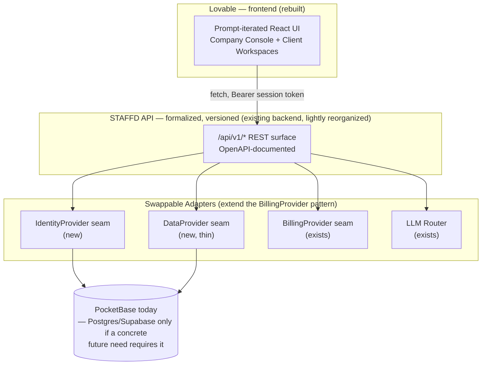
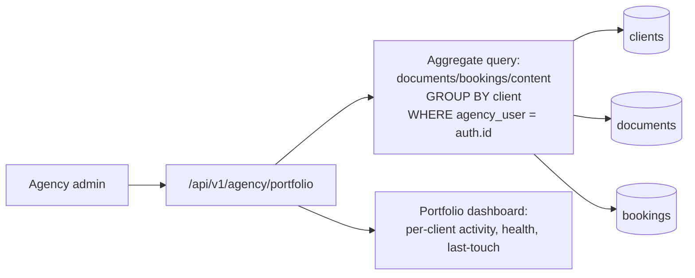

# STAFFD — Rebuild-in-Lovable Recommendation

**Companion to:** `STAFFD-SAD.md` (read that first — this document assumes its findings)
**Question being answered:** if we started over today, would rebuilding STAFFD with Lovable as the frontend, plug-and-play tools in the background, and a proper multi-client "one company, many client workspaces" model be better — and if so, how?

---

## 1. The honest architectural answer first

**Do not rebuild the backend from scratch. Do not migrate to Supabase to "get" Lovable's magic. Do rebuild the frontend in Lovable, against the existing API, and finish the one real gap (agency portfolio view) as a backend feature — not a frontend one.**

Here's the reasoning, stated plainly because a senior architect handing this off owes you the real trade-off, not the answer that's most exciting to hear:

### 1.1 What Lovable is actually good at
Lovable's core magic — describe a UI in English, get working polished React, iterate by re-prompting — is real and valuable for STAFFD's *presentation* layer. Its **native backend automation** (auto-generated schema, auth, storage, edge functions, "Lovable Cloud") is built around **Supabase specifically**. Lovable can absolutely call an arbitrary REST API too (it's just generating React/TypeScript that does `fetch`), but you only get the "everything is plug-and-play inside Lovable" experience if your backend *is* Supabase.

### 1.2 What migrating to Supabase would actually cost
STAFFD's current backend is not a thin CRUD layer. It is ~170 API route files encoding a year-plus of hardened, non-obvious business logic:
- A row-rule-enforced multi-tenancy model (`AGENCY_OWNED_RULES`) that is *the reason* one agency can never see another's client data — this is PocketBase-specific syntax, but the *property* it guarantees (isolation enforced by the database, not the app) has to be re-earned in Postgres RLS policies, function by function, tenant scenario by tenant scenario.
- A credit/billing metering system, an autopilot graduation+audit system, a workflow planner+execution substrate, GDPR cascade-delete across 25 collections, and a Vault retrieval system already backed by an *external* vector DB (Qdrant) — none of which is "just data," all of which is logic that would need to be re-derived and re-tested, not copy-pasted.
- 1121 passing tests that encode real production incidents this system has already survived (a Vercel 4.5MB body cap that silently broke uploads, IDOR bugs in billing routes, a field-name bug that silently no-op'd subscription cancellation on account deletion). A rewrite risks reintroducing every one of these, because the tests that catch them are tied to the current implementation.

Rebuilding the backend to "unlock" Lovable's Supabase magic means paying that cost for a benefit — DB/auth swappability — that STAFFD does not currently need. Nothing in the requirements says "must run on Supabase." The actual requirement, read carefully from your own framing, is: **polished, rapidly-iterable frontend** + **plug-and-play background tools** + **one company running many isolated client workspaces**. All three of those are achievable without touching PocketBase.

### 1.3 What should actually change
Two things, and only two:
1. **The frontend gets rebuilt in Lovable**, consuming the existing (or lightly formalized) STAFFD API over plain REST. You get Lovable's iteration speed and design polish without re-deriving a single line of the hardened backend.
2. **The one real gap — an agency portfolio/aggregate view — gets built**, because it's genuinely missing today (see SAD §4.2), not because a rebuild demands it.

Everything else (LLM routing, billing, Vault retrieval, autopilot, planner) is either already plug-and-play or doesn't need to be to satisfy the actual requirement.

---

## 2. Target architecture

**Key design decision: the `DataProvider`/`IdentityProvider` seams are thin wrappers around the *existing* PocketBase calls, not a rewrite.** Their entire value is optionality — if in three years there's a concrete, specific reason to move off PocketBase (e.g., a real multi-region write requirement PocketBase can't satisfy), the seam means that's a contained migration instead of a rewrite. Until then, they cost almost nothing and change no behavior.

---

## 3. Solving the actual ask: "one company runs it for many clients, sees it all"

This is a backend/data-model feature, and it's the one genuinely missing piece. Here's the concrete design:

### 3.1 New capability: Agency Portfolio API

- `GET /api/v1/agency/portfolio` — one call, returns every owned client plus rollup counts (documents this month, last activity, active autopilot count, plan add-ons in use). This is pure aggregation over data that **already exists**; the row rules already guarantee no cross-agency leakage, so this route only needs to add `GROUP BY client` on top of queries STAFFD already runs per-client today.
- **This finally makes the ClientSwitcher + `clients` collection + `AGENCY_OWNED_RULES` foundation (already built, per SAD §4.1) pay off as a real "company sees it all" experience**, instead of "click into each client one at a time."
- The currently-404'd `/dashboard/clients` page gets rebuilt (in Lovable) as this portfolio dashboard — this *is* the completion of the pending "W94 Operator Access System" work, just done as part of the frontend rebuild rather than separately.

### 3.2 Why this is superior to a from-scratch multi-tenant redesign
Building this as an aggregation layer on top of the existing row-rule-isolated schema means the isolation guarantee (the hardest, highest-stakes part of multi-tenancy to get right) is inherited for free. A from-scratch rebuild would have to re-prove that no agency can see another agency's data; this approach never has to re-litigate it.

---

## 4. Step-by-step rebuild plan

1. **Formalize the API surface** (backend, ~1-2 weeks). Group the existing `app/api/**` routes under a versioned `/api/v1/` prefix (or an API gateway layer if you'd rather not move 170 files), write an OpenAPI spec from the real request/response shapes, and add the two new adapter seams (`IdentityProvider`, `DataProvider`) as thin pass-throughs to existing PocketBase calls — no behavior change, purely a documented, stable contract for Lovable to build against.
2. **Build the Agency Portfolio API** (backend, ~1 week). The aggregation route described in §3.1, plus the tests that prove agency A's aggregate never includes agency B's rows.
3. **Stand up Lovable against the real API** (frontend, incremental). Start with one surface — recommend the Dashboard + Department chat, since it's the highest-traffic surface — prompted against the *real, documented* `/api/v1/` endpoints, not mocked data. Verify auth (session token in `Authorization` header) works end-to-end before building further.
4. **Rebuild surface-by-surface**, in traffic order: Dashboard → Department chat/CommandCenter → Document Library → Settings/Billing → the new Agency Portfolio dashboard → Booking pages. Each surface ships independently; the old Next.js frontend and the new Lovable frontend can coexist on different routes during the transition (they both call the same API).
5. **Cut over DNS/routing** once every surface has parity, keeping the old frontend deployable as a rollback for one release cycle.
6. **Decommission the old Next.js frontend** only after the new one has run in production through at least one full billing cycle with no regressions.

**Explicitly out of scope for this plan:** migrating PocketBase to Supabase, rewriting the LLM router, rewriting the Vault/Qdrant retrieval logic, or touching the autopilot/planner execution substrate. All of that is backend logic that Lovable never needs to know exists — it just calls the API.

---

## 5. Why this is superior to the two obvious alternatives

| Alternative | Why it's worse |
|---|---|
| **Full rewrite in Lovable + Supabase** | Re-derives a year of hardened tenant-isolation and billing logic from scratch, discards 1121 tests, and re-risks every incident this session already fixed. High cost, no capability STAFFD is currently missing. |
| **Do nothing, keep the current Next.js frontend** | Never gets the UX/iteration-speed benefit you're asking for, and the agency-portfolio gap stays unbuilt regardless of frontend choice — so it doesn't even preserve the status quo, it just leaves the real gap unaddressed. |
| **Frontend-in-Lovable + backend-on-existing-API (this plan)** | Gets the UX/iteration win, closes the actual multi-client gap, preserves every hardened security/billing/autonomy guarantee, and is reversible at every step (old frontend keeps working until the new one has proven itself). |

---

## 6. Concrete Lovable prompting strategy

Lovable projects work best when the first prompt establishes ground truth once, and every subsequent prompt is a small, scoped iteration on it. Suggested sequence:

**Prompt 1 — establish the contract (do this once, keep it as project memory/pinned instructions):**
> "This app is a frontend only. It talks to an existing REST API at `{API_BASE_URL}`. Every authenticated request must include `Authorization: Bearer <token>` where the token comes from a login call to `POST /api/v1/auth/login`. Do not generate a database, do not use Supabase for data — only for anything I explicitly ask you to store client-side (like UI preferences). All business data comes from the API described in the attached OpenAPI spec. When a call returns a `503` with `{error: "billing_not_configured"}`, show a friendly 'Billing isn't connected yet' message, never a raw error."

**Prompt 2 — the shell:**
> "Build the app shell: a left-nav or top-nav with Dashboard, Departments (9 icons: Marketing, Sales, Legal, HR, Finance, Operations, Paid Media, Design, Reputation), Library, Settings. If the logged-in user's plan is 'agency', add a client-switcher dropdown in the header that calls `GET /api/v1/clients` and stores the active client id. Dark theme, card-based layout, consistent border/spacing tokens — apply Hick's Law: the department grid should be flat, not nested, so all 9 are visible in one glance."

**Prompt 3 — one surface at a time:**
> "Build the Department chat surface (CommandCenter). It posts to `POST /api/v1/orchestrate` with `{department, task}` and streams the response. Show a typing/streaming indicator (Doherty Threshold — never a silent wait over 400ms). Persist and reload thread history from `GET /api/v1/conversations?department=X`."

**Prompt 4 — the new capability:**
> "Build the Agency Portfolio dashboard at a new route, visible only when plan === 'agency'. It calls `GET /api/v1/agency/portfolio` and renders one card per client showing: name, documents this month, last activity date, active add-ons. Clicking a card sets that client as active (same mechanism as the header switcher) and navigates to that client's Dashboard."

**Iterate, don't re-prompt from scratch:** for every subsequent change, prompt Lovable against the *existing* generated component ("On the Department chat screen, add a 'Save to Library' button that calls X") rather than regenerating the whole surface — this is what keeps Lovable's iteration model fast and avoids design drift between surfaces.

**Guardrail prompt to reuse whenever Lovable drifts:** "Don't invent new API endpoints. If a feature needs data the API doesn't provide yet, stop and tell me what endpoint you need instead of mocking it."

---

## 7. Summary

Keep the backend. Formalize its API surface. Build the one genuinely missing feature (agency portfolio aggregation) on top of the isolation guarantees that already exist. Rebuild the frontend in Lovable against that real API, surface by surface, in traffic order. This gets you everything in the original ask — polished UX, plug-and-play feel, one company running many isolated client workspaces, "the company sees it all" — without gambling a working, tested, revenue-bearing system on a from-scratch rewrite.
